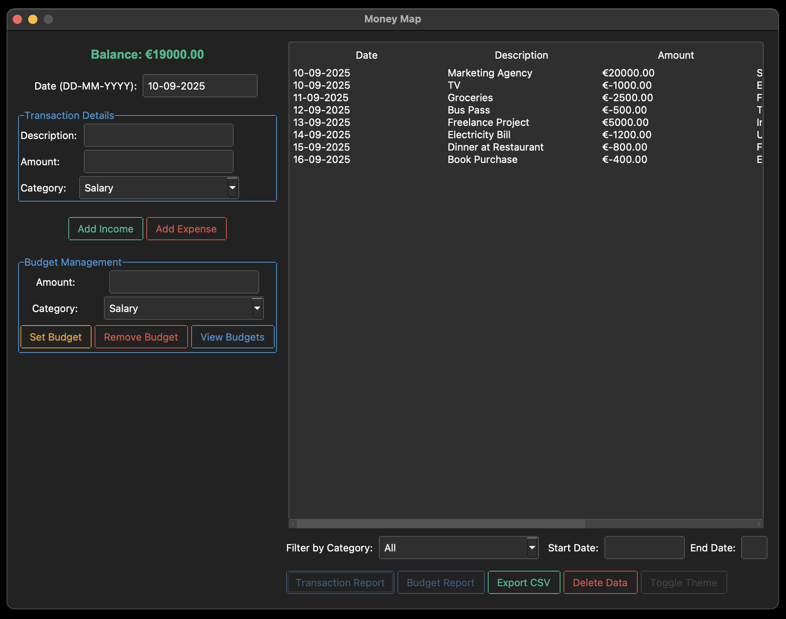
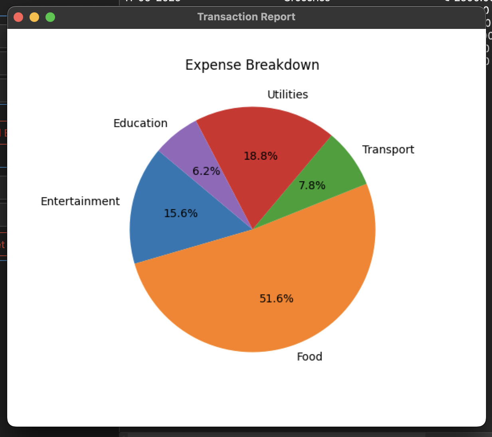

# Money Map


Money Map is a personal finance management application built using Python and Tkinter. It allows users to track their income and expenses, set budgets, and visualize their financial data through interactive graphs.

## Features

- **Categorization of transactions**: Easily categorize income and expenses.
- **Budget creation and management**: Set up budgets and track spending.
- **Financial summary reports and visualizations**: View financial summaries with pie charts and other visualizations.
- **File-based storage**: Uses JSON for storing data.
- **User-friendly interface**: Integrated with Figma UI assets, enhanced with Pillow and Tkinter.
- **Income functionality**: Supports better handling of expenses and budgeting by tracking income.

## Requirements

- Python 3.x
- Tkinter
- ttkbootstrap
- Matplotlib
- Pillow

## Installation and Usage
### Installation

1. Clone the repository:
   ```bash
   git clone https://github.com/Money-Map-Team/Money-Map.git
   cd Money-Map
   ```

2. Create virtual environment variable:
   ```bash
   python -m venv .venv
   ```

3. Activate the environment:
   ```bash
   .\.venv\Scripts\activate
   ```
4. Install the required libraries:
   ```bash
   pip install matplotlib ttkbootstrap
   ```
4. Run the file:
   ```bash
   python main.py
   ```
### Usage
- Add income or expenses with detailed descriptions and categories.
- Set budgets for different categories and monitor your spending.
- Visualize your financial data with interactive graphs.
- Export your transaction data to CSV for further analysis.

## Screenshots





## License
This project is licensed under the MIT License - see the [LICENSE](LICENSE) file for details.
   
   
